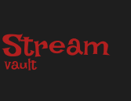

  

  
  
  
  
  

# StreamVault

StreamVault is a modern streaming application built with Flutter, designed to offer high-performance video playbacks and synchronized metadata parsing using a localized backend architecture.

## Main Features

* Just-In-Time Synchronization: Automatically fetches and synchronizes content catalogs and metadata when detail pages are opened.
* Adaptive Bitrate Video Player: Embedded HLS player that supports auto-scaling of video resolutions based on network bandwidth.
* Intelligent Headless Bypass: Performs cookie harvesting in the background to handle web security barriers smoothly, with an interactive visual fallback when necessary.
* Advanced Curation Filters: Allows browsing content based on genres, production countries, release years, and networks.
* Cinematic Glow Interface: Premium dark UI featuring dynamic backdrop glows and auto-hide player control states.

## Architecture and Patterns

The codebase is organized using a feature-first clean architecture pattern to ensure maintainability and testability.

### Project Structure
* core: Houses shared modules such as network clients, routing, theme systems, and utility services.
* features: Organized by functional domains (home, detail, search). Each feature folder contains its own layers:
  * data: Models, datasources, and repository implementations.
  * domain: Providers and business logic.
  * presentation: Widgets, screens, and UI elements.
* shared: Reusable atomic widgets, molecules, and organisms (such as custom player UI components).

### Key Patterns
* MVVM (Model-View-ViewModel): Used in conjunction with Riverpod to separate UI rendering from business states.
* Repository Pattern: Abstracts data storage and remote API fetches behind clean interfaces.
* State Management: Riverpod is used for declarative, reactive state flow and dependency injection.

## Acknowledgments

We would like to thank TMDB (The Movie Database) for providing their comprehensive public API which powers our rich metadata, including titles, descriptions, posters, and cast details.

## Creator

<table align="left" style="border-collapse: collapse; border: none; border-spacing: 0px;">
  <tr style="border: none;">
    <td align="center" valign="middle" style="border: none; padding-right: 15px; padding-bottom: 15px;">
      
    </td>
    <td align="left" valign="middle" style="border: none; padding-bottom: 15px;">
      <h3 style="margin: 0 0 4px 0; border: none; font-size: 1.4em;">havilz lating</h3>
      
StreamVault Creator

      
      
      
      
      
    </td>
  </tr>
</table>

 

